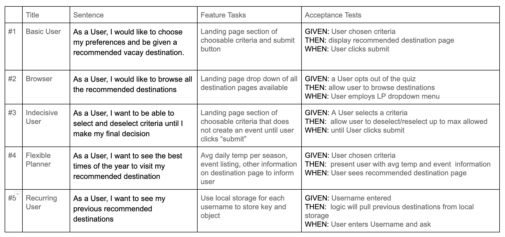
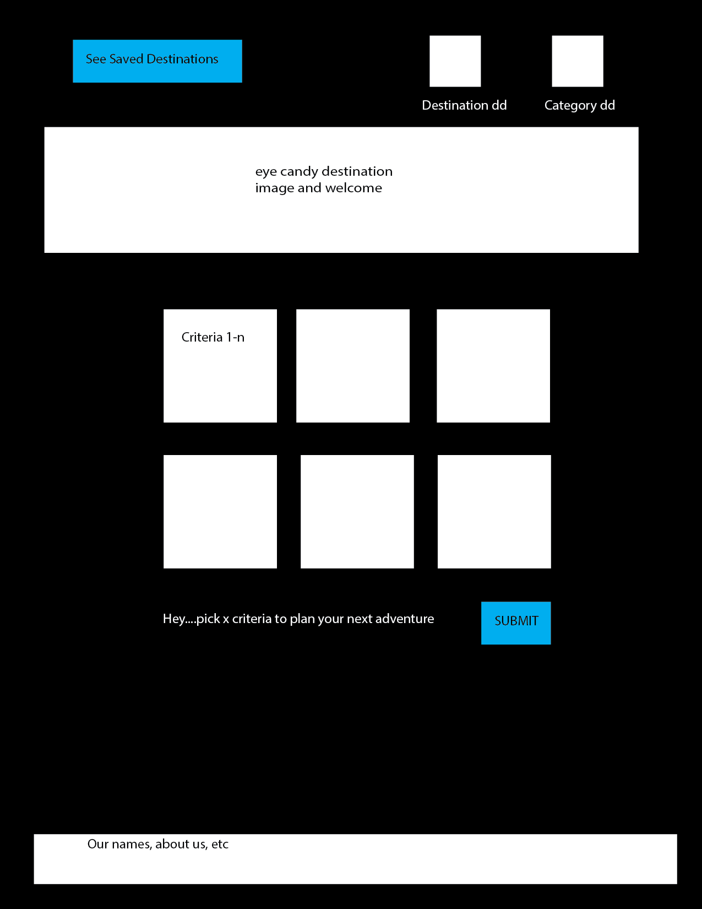
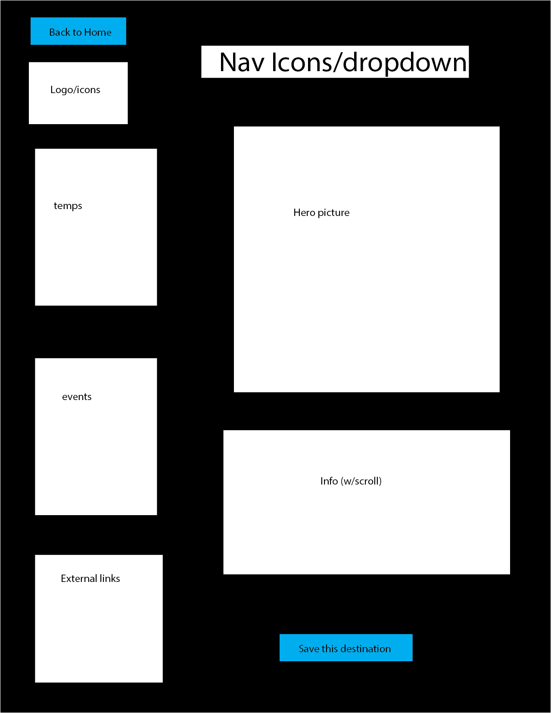
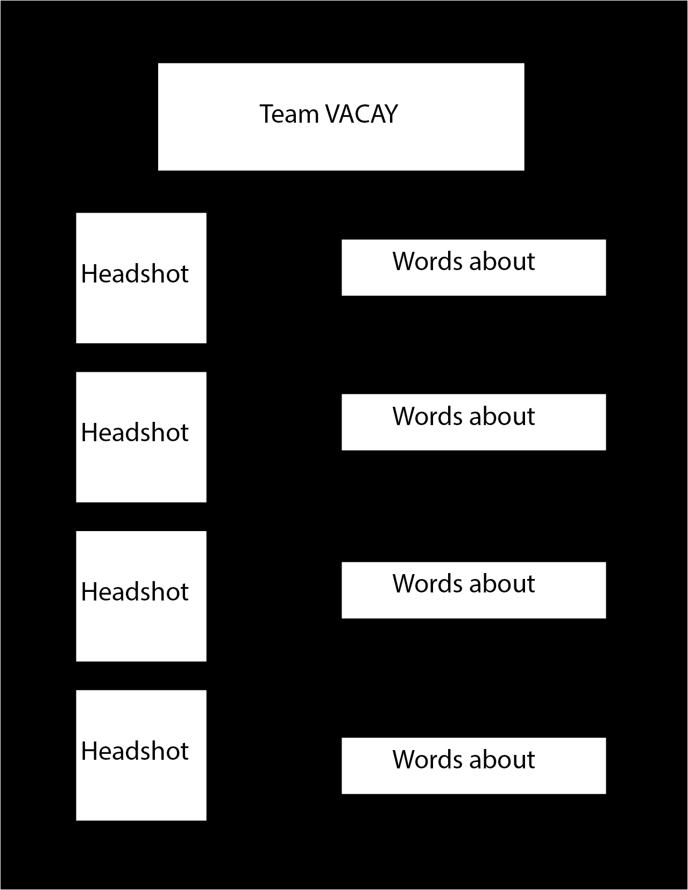
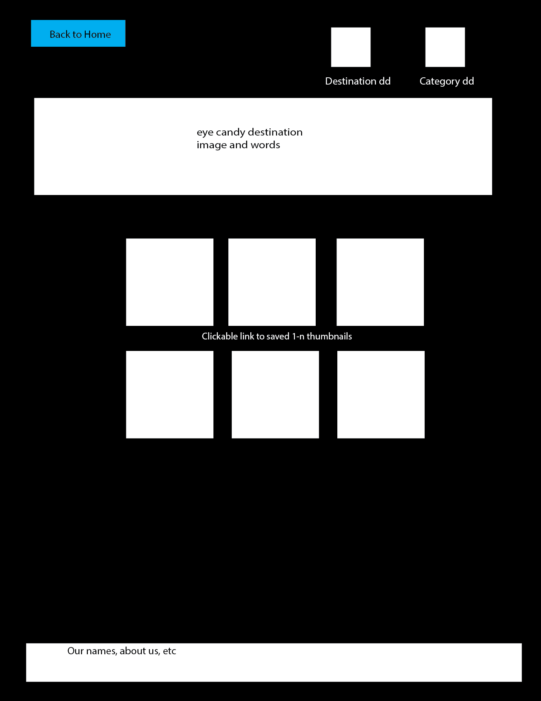
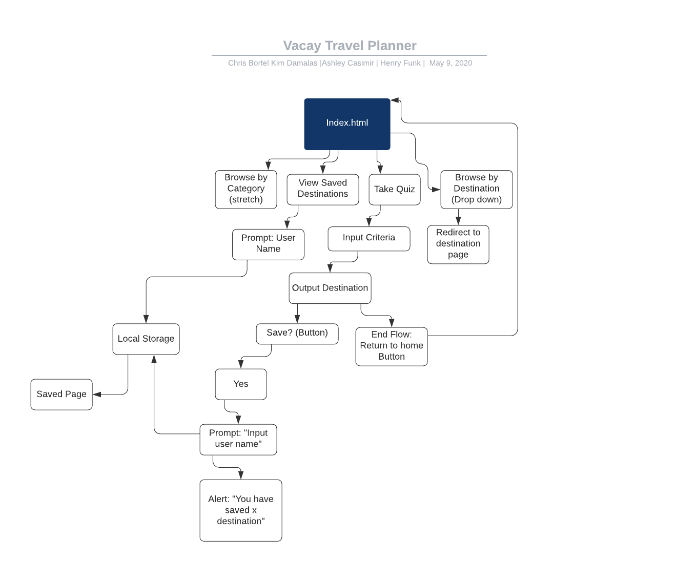

# Team Vacay
***********************

## About
This is a web based interactive application built with the purpose of providing users with a way to explore travel options based on their preferences. 

***********************

## Problem Domain

To get people excited about traveling after the quarantine is lifted, we propose a travel planning app. By answering a few questions about priorities and preferences, the user will form a description of his/her dream vacay. Our app will ingest the user preferences and return a recommended destination with information to help the user plan a trip to that destination. Users will be directed to pick (a minimum of 2) criteria most important to them.  Our team will ensure that every combination of criteria results in at least one specific destination recommendation with accompanying destination info, pro tips, helpful links. Our team will also ensure the user has the ability to browse all of our destination pages rather than enter specific preferred criteria.

### Team Members

- Kim Damalas
- Ashley Casimir
- Henry Funk 
- Chris Bortel

## User Stories

## Wireframe
### Landing Page

### Destination Page

### About Us

### Saved Destination Page

## Domain Modeling

