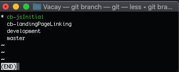

#Team Vacay Git Flow

The Team Vacay main documentation can be viewed [here](README.md).


## Starting the day
The night before, we should have all updated our local machine with the merged code. This is what that should have looked like. 


- First make sure that you have saved the changes that you have made to your feature branch.
- Then we start this process. 
 
```
git checkout master
git pull origin master

git checkout development
git pull origin master

git checkout -b <YOUR_new_branch>
```
At this point, your local feature branch should be up to date with the -remote Master branch
  - We should immediately checkout to our new branch in order to not accidentally start coding on the master or developement branch the next time that we start working. 

## Now that is set
Verify what branch you are on using 
``` 
git branch
```
- Do this at the start of new day, whenever we have merged, or anytime that you are not sure where you are. 



- Says that I am currently working on cb-jsInitial
- **Press q to escape** and go back to your terminal session. 


Merging flow
- we will merge each branch one at a time
- make pull request
- review pull request
- merge pull request to development 
- check the code on git hub, confirm merge
- checkout to local dev. 
- git pull origin dev
- git checkout `<feature>`
- Check to see if there are any merge errors on your branch on vs code
- git push origin <feature>
- create pull request, and repeat.


 
## Example
I merge to dev and we accept the pull request
  - then everyone pulls down to their dev from the newly updated repo.
  - Next, Henry  will merge to dev, accept the pull request, and then everyone pulls to their dev from the repo.
  -  Next person goes, and so on.


After every push to dev, everyone pulls from dev.
